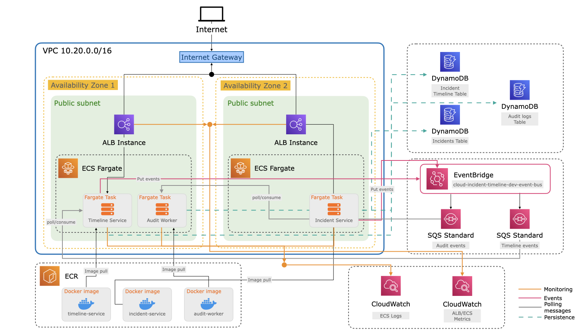

# Cloud Incident Timeline

A hands-on learning project that builds a real-world incident management system using **decoupled microservices** that communicate asynchronously through **event-driven architecture**. Learn how to design scalable, resilient systems on AWS using **Terraform for Infrastructure as Code**, modern messaging patterns with EventBridge and SQS, and containerized services with ECS Fargate.

## About

A hands-on project to learn:
- **Microservices architecture** — Multiple independent services communicating via APIs
- **Event-driven patterns** — Async communication using EventBridge and SQS
- **Infrastructure as Code** — Terraform on AWS (ECS, DynamoDB, ALB)

## Tech Stack

- **Services**: Python 3.11, FastAPI
- **Container Runtime**: ECS Fargate
- **Data**: DynamoDB (NoSQL)
- **Messaging**: EventBridge, SQS
- **API Gateway**: Application Load Balancer (ALB)
- **Infrastructure**: Terraform

## Architecture Diagram



## Project Structure

```
.
├── infrastructure/          # Terraform modules & environments
│   ├── modules/            # Reusable AWS components
│   └── environments/dev/    # Dev environment configuration
├── services/               # Microservices
│   ├── incident-service/   # HTTP API for incident management
│   ├── timeline-service/   # HTTP API for incident timeline
│   └── audit-worker/       # Async worker for audit logs
└── .github/specs/          # Architecture & implementation specs
```

## Cost Estimation

This project is designed for **minimal cost** using AWS Free Tier services. Estimated daily cost with light testing:

| Service | Configuration | Daily Cost |
|---------|---------------|-----------|
| **ECS Fargate** | 3 tasks × 256 CPU (0.5 GB) | ~$1-2 |
| **DynamoDB** | On-demand pricing, 3 tables | ~$0-1 |
| **Application Load Balancer** | Fixed hourly charge | ~$0.50 |
| **CloudWatch Logs** | 3-day retention, minimal volume | ~$0.10 |
| **Data Transfer** | Internal AWS communication | ~$0 |
| **EventBridge + SQS** | Minimal volume, within free tier | ~$0 |
| | **Total Estimated Daily Cost** | **~$2-5** |

**Cost-Control Strategies:**
- ✅ No NAT Gateway (saves ~$32/month)
- ✅ No autoscaling (predictable, fixed cost)
- ✅ Public subnets only (minimal data transfer)
- ✅ Destroy after testing (pay only during active use)

## Quick Start

```bash
# 1. Set up infrastructure
cd infrastructure/environments/dev
terraform init
terraform plan
terraform apply

# 2. Deploy services (see deployment guide)
# 3. Test endpoints (see service README files)
```

## Documentation

### Getting Started
- [**Architecture**](./docs/ARCHITECTURE.md) — Complete system design with diagrams
- [**Deployment Guide**](./docs/DEPLOYMENT.md) — Prerequisites, setup, validation
- [**Destroy Guide**](./docs/DESTROY.md) — Safe cleanup, backup strategy

### Service Documentation
- [incident-service](./services/incident-service/README.md) — REST API for incident CRUD
- [timeline-service](./services/timeline-service/README.md) — Timeline queries & comments
- [audit-worker](./services/audit-worker/README.md) — Event processing & audit logs

### Comprehensive Checklist
- [**Phase 5: Documentation Completion**](./docs/PHASE_5_COMPLETION.md) — All documentation verified & complete

### Specifications (Deep Dive)
- [Project Context](./github/specs/00-project-context.md)
- [Architecture Spec](./github/specs/01-architecture.md)
- [Data & Events](./github/specs/06-data-and-events.md)
- [Cost Control](./github/specs/07-cost-control.md)
